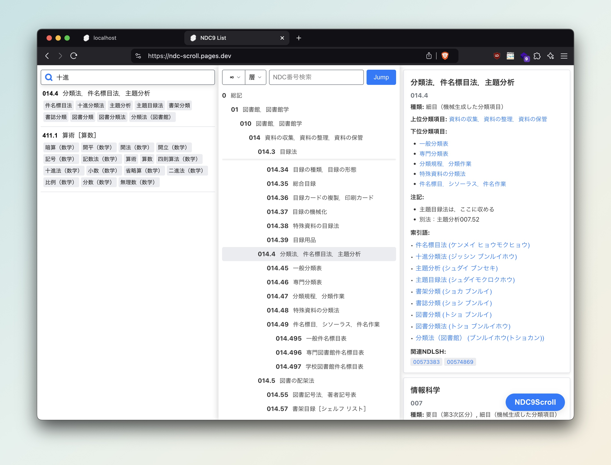

# NDC Scroll
[](https://choosealicense.com/licenses/mit/)
[](https://github.com/cojiso/ndc-scroll)
[](https://github.com/cojiso/ndc-scroll/releases)

## 概要


### NDC Scrollとは
NDC Scrollは、日本十進分類法（NDC）のデータを視覚化するツールです。NDCの階層構造を探索するための対話的な操作画面を提供し、検索機能、詳細表示、階層表示のスティッキースクロールなどの機能を備えています。

### NDCとは
NDC（Nippon Decimal Classification; 日本十進分類法）とは、日本の図書館で広く使われている分類法です。NDC Scrollでは、日本図書館協会が提供するNDC9（日本十進分類法第9版）のデータを使用しています。

## 利用者向け情報
### 動作確認用サイト
実際の動作を確認できるサイト: https://ndc-scroll.pages.dev

### 特徴
- 日本十進分類法（NDC）第9版の利用と視覚化
- 階層構造の対話的な探索
- 特定の分類へ素早くアクセスするための検索機能
- 各分類項目の詳細表示
- 操作性向上のためのスティッキースクロール
- パソコンと携帯端末の両方に対応した画面設計

### 使用方法
1. 動作確認用サイト（https://ndc-scroll.pages.dev）にアクセスします。
2. 左側の検索欄を使用して特定の分類を検索するか、中央の一覧をスクロールしてNDCの階層構造を探索します。
3. 項目をクリックすると、右側に詳細情報が表示されます。

### 先行プロジェクト
NDC Scrollは以下の先行ツールにインスパイアされています:

- **NDC Suggest**: 
  - http://kuroyuri.media.osaka-cu.ac.jp/~ueda/ajax_ndc/
  - 開発: 大阪市立大学大学院創造都市研究科（学術情報総合センター）村上研究室
  - 特徴: Ajax技術を用いたNDC検索システム。NDC分類記号もしくはキーワードを入力すると関連する分類を表示する。

- **NDC Suggest**: 
  - http://jasmine.media.osaka-cu.ac.jp/ndc_navi10/about  
  - 開発: 村上晴美（大阪公立大学／大阪市立大学）・ 浦芳伸（winspire）  
  - 特徴: NDC10（日本十進分類法10版）の電子化版であるNDC・MRDF10を探すことができる。相関索引の検索や、国立国会図書館サーチ、大阪公立大学蔵書検索（OPAC）との連携機能を提供。

## 開発者向け情報
### 使用技術
- [Svelte](https://svelte.dev/) + [SvelteKit](https://kit.svelte.dev/)
- TypeScript
- [Lucide Icons](https://lucide.dev/)
- [ttl2jsonld](https://github.com/frogcat/ttl2jsonld) (データ変換に使用)

### 必要環境
- Node.js (v20.18.0 以降)
- npm (Node.jsに付属)

### セットアップ
#### インストール
1. リポジトリをクローンします:
```
git clone https://github.com/your-username/ndc-scroll.git
cd ndc-scroll
```

2. 依存関係をインストールします:
```
npm install
```

#### 開発サーバーの起動
```
npm run dev
```

ブラウザを開き、`http://localhost:5173`（または端末に表示されたポート）にアクセスします。

#### 本番用ビルド
アプリケーションの本番バージョンを作成するには:
```
npm run build
```
本番ビルドをプレビューするには:
```
npm run preview
```

### プロジェクト構成
- `src/routes/`: 主要な画面構成要素とページを含む
- `src/lib/`: 汎用関数と型定義
- `src/store/`: 状態管理用の svelte/store
- `static/`: 静的アセット

### 貢献方法
プロジェクトへの貢献を歓迎します。不具合報告、機能提案、変更依頼などはGitHubのIssueやPull Request機能を使用してください。

## プロジェクト情報
### ライセンス
このプロジェクトのソースコードは[MITライセンス](LICENSE)の下で公開されています。

NDC9のデータは日本図書館協会が提供するもので、[CC-BYライセンス](https://creativecommons.org/licenses/by/4.0/)の下で使用しています。詳細は[日本図書館協会のウェブサイト](https://www.jla.or.jp/committees/bunrui/tabid/789/Default.aspx)をご覧ください。

### 謝辞
- NDC9データは[日本図書館協会](https://www.jla.or.jp/)が提供するものを使用しています
- [@frogcat/ttl2jsonld](https://github.com/frogcat/ttl2jsonld)を使用してTurtleファイルをJSONに変換しています
- VSCodeのスティッキースクロール機能を参考にしています
- [国立国会図書館](https://www.ndl.go.jp/)のNDLSHデータを参照しています

### 連絡先
プロジェクトに関する質問や提案がある場合は、GitHubのIssueを作成するか、[プロジェクトのリポジトリ](https://github.com/your-username/ndc-scroll)にアクセスしてください。